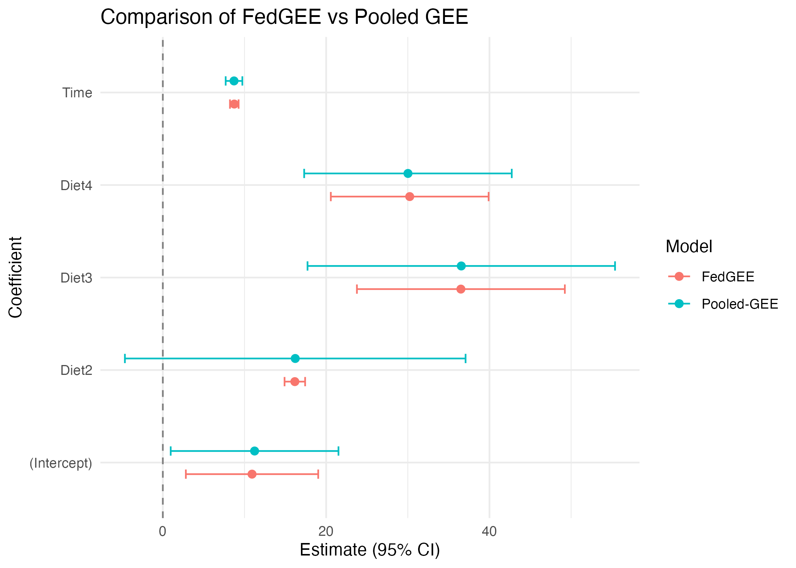

# FedGEE

**FedGEE** (Federated Generalized Estimating Equations) provides a robust framework for fitting generalized estimating equations across distributed datasets (e.g., multi-center health networks) without pooling patient-level data. It includes small-sample variance corrections (Kauermann-Carroll and Mancl-DeRouen) which are applied directly in the score space to preserve privacy and statistical validity when the number of contributing sites is small.

## Installation

You can install the development version of FedGEE from source using the `devtools` package:

```r
# install from source available on GitHub:
# devtools::install_github("soumikp/2026_fedGee")
```

## Features
- **Privacy-Preserving**: Only summary-level matrices (e.g., Bread and Score matrices) are aggregated at the server.
- **Small-Sample Corrections**: Includes `KC` (Kauermann-Carroll) and `MD` (Mancl-DeRouen) corrections.
- **Cluster/Patient-Level Adjustments**: Allows sandwich variance estimation at the site-level or patient-level.

## Toy Example

Here is a small example using a known built-in R dataset (`ChickWeight`), simulating a scenario where longitudinal patient records are distributed across multiple "sites". 

```r
library(FedGEE)

# 1. Prepare data using the built-in 'ChickWeight' dataset
# We'll split the data into 3 arbitrary "sites" based on the Chick ID modulo 3
data(ChickWeight)
df <- ChickWeight

# Create a mock 'site' variable
df$site <- paste0("Site_", as.numeric(df$Chick) %% 3 + 1)

# Split the dataframe into a list of dataframes by site
data_list <- split(df, df$site)

# 2. Fit the Federated GEE Model
# We model weight ~ Time + Diet across our dummy sites
fed_model <- fedgee(
  data_list      = data_list,
  main_formula   = weight ~ Time + Diet,
  family_obj     = gaussian(link = "identity"),
  corstr         = "exchangeable",     # Working correlation structure
  id_col         = "Chick",            # Column indicating clusters
  sandwich_level = "site",             # Level for sandwich variance
  correction     = "KC",               # Kauermann-Carroll small-sample correction
  verbose        = FALSE
)

# 3. Fit the Pooled GEE Model for Comparison
# This requires the geepack package and the pooled dataset
library(geepack)
pooled_model <- geeglm(
  weight ~ Time + Diet, 
  data = df[order(df$Chick), ], 
  id = Chick, 
  family = gaussian(link = "identity"), 
  corstr = "exchangeable"
)

# 4. Compare via Forest Plot
library(dplyr)
library(ggplot2)

fed_df <- data.frame(
  term = names(fed_model$coefficients),
  estimate = fed_model$coefficients,
  std.error = fed_model$se,
  model = "FedGEE"
)

pooled_sum <- summary(pooled_model)$coefficients
pooled_df <- data.frame(
  term = rownames(pooled_sum),
  estimate = pooled_sum$Estimate,
  std.error = pooled_sum$Std.err,
  model = "Pooled GEE"
)

plot_data <- bind_rows(fed_df, pooled_df) |>
  mutate(
    conf.low = estimate - 1.96 * std.error,
    conf.high = estimate + 1.96 * std.error
  )

ggplot(plot_data, aes(x = estimate, y = term, color = model)) +
  geom_point(position = position_dodge(width = 0.5), size = 2) +
  geom_errorbar(aes(xmin = conf.low, xmax = conf.high), 
                position = position_dodge(width = 0.5), width = 0.2) +
  geom_vline(xintercept = 0, linetype = "dashed", color = "gray50") +
  theme_minimal() +
  labs(
    title = "Comparison of FedGEE vs Pooled GEE",
    x = "Estimate (95% CI)",
    y = "Coefficient",
    color = "Model"
  )
```


